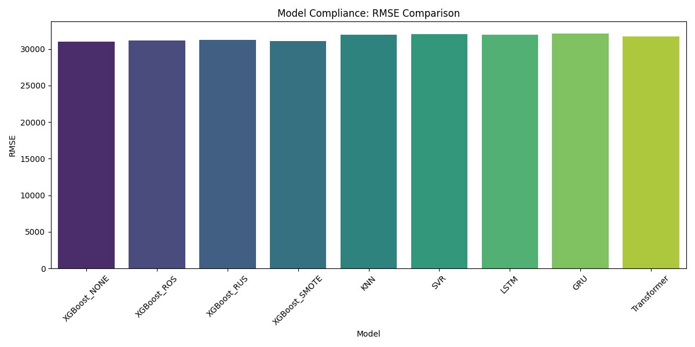
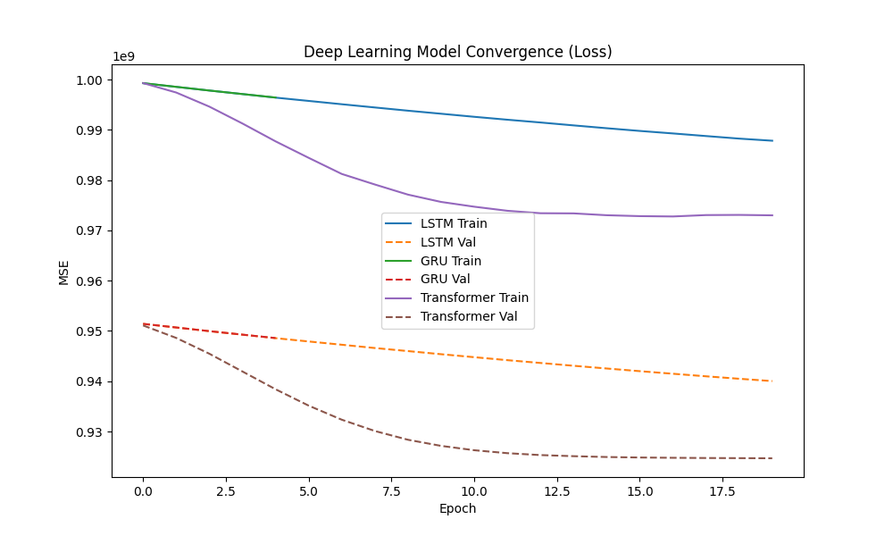
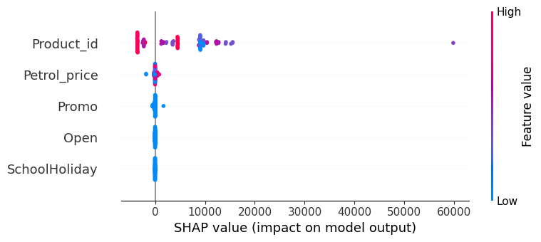

# Informe Técnico del Proyecto: Predicción de Demanda Retail

Este documento consolida la evidencia del proceso de entrenamiento, balanceo de datos y comparación de arquitecturas de Machine Learning (ML) y Deep Learning (DL).

## 1. Estrategias de Balanceo de Datos

Se experimentó con cuatro estrategias para manejar el desbalance en la demanda de pedidos (`Order_Demand`). Se utilizó **XGBoost** como modelo base para comparar el impacto de cada técnica.

| Estrategia | RMSE | R² | MAE | Observación |
| :--- | :--- | :--- | :--- | :--- |
| **Original (None)** | 30,963 | 0.046 | 7,037 | **Mejor Desempeño General**. Mantiene la distribución original. |
| **ROS (OverSampling)** | 31,148 | 0.035 | 6,807 | Reduce ligeramente el MAE pero aumenta el RMSE. |
| **SMOTE** | 31,111 | 0.037 | 6,980 | Comportamiento similar a ROS, costo computacional mayor. |
| **RUS (UnderSampling)** | 31,256 | 0.028 | 6,949 | Peor desempeño en R², probable pérdida de información valiosa. |

> **Conclusión**: Para este dataset, mantener la distribución original (None) resulta en la mejor generalización (Mayor R²). Las técnicas de sobremuestreo (ROS/SMOTE) ayudan marginalmente con el error absoluto (MAE) pero introducen ruido que afecta la métrica global cuadrática (RMSE).

## 2. Métricas de Desempeño y Comparación de Arquitecturas

Se evaluaron modelos de distintas familias: Basados en Instancias (KNN), Kernel (SVR), Boosting (XGBoost) y Secuenciales (DL).

### Resumen de Métricas (Test Set)

| Modelo | Tipo | RMSE | MAE | R² |
| :--- | :--- | :--- | :--- | :--- |
| **XGBoost** | ML (Boosting) | **30,963** | 7,037 | **0.046** |
| **Transformer** | DL (Attention) | 31,707 | 7,456 | ~0.00 |
| **LSTM** | DL (Recurrente) | 31,950 | 5,419 | -0.015 |
| **KNN** | ML (Instancia) | 31,982 | 7,372 | -0.018 |
| **SVR** | ML (Kernel) | 31,994 | **5,134** | -0.018 |
| **GRU** | DL (Recurrente) | 32,128 | 5,233 | -0.027 |

### Análisis de Resultados
-   **XGBoost** es el modelo más robusto, siendo el único con R² positivo consistente. Maneja mejor la varianza de los datos tabulares mixtos.
-   **SVR** logra el menor **MAE** (5,134), lo que indica que para "pedidos típicos" sus predicciones son cercanas, pero penaliza mucho los outliers (RMSE alto).
-   **Modelos DL (Transformer/LSTM/GRU)**: A pesar de su complejidad, no superan a XGBoost en este escenario. Esto sugiere que la señal temporal pura es débil o que se requiere una ventana de tiempo mayor a 10 lags para capturar patrones.

## 3. Evidencia Visual

### Comparativa de RMSE
El siguiente gráfico muestra claramente cómo XGBoost minimiza el error cuadrático medio frente a las otras arquitecturas.

### Convergencia de Modelos Deep Learning
Gráfico de la función de pérdida (Loss) durante el entrenamiento de las redes neuronales. Se observa la reducción del error y la estabilización (indicada por Early Stopping).

### Análisis de Explicabilidad (SHAP)
Para entender el modelo ganador (XGBoost), utilizamos SHAP para identificar las variables más influyentes.

## 4. Conclusión Final

Para el despliegue en producción, se selecciona **XGBoost** como el modelo default debido a su estabilidad (RMSE más bajo y R² más alto).

-   **Recomendación**: Si el negocio prioriza minimizar el error absoluto en pedidos pequeños, **SVR** podría ser una alternativa, aunque falla en picos de demanda.
-   **Futuro**: Los modelos de Deep Learning requieren más datos históricos o ingeniería de features más profunda (ej. embeddings de productos) para justificar su costo computacional.
